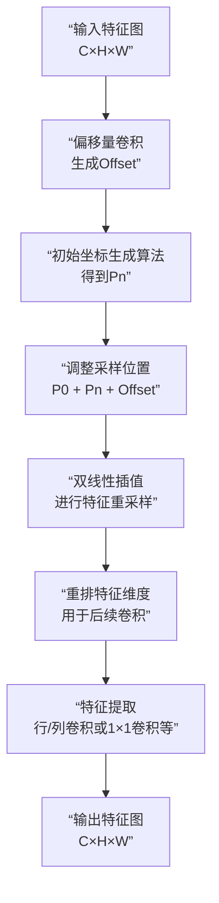

### 一、核心思想

本文针对标准卷积操作存在的两个固有缺陷：**感受野受限**于局部窗口且**采样形状固定**，以及卷积核尺寸固定为k×k导致**参数量随尺寸平方增长**的问题，提出了一种名为**可变核卷积（AKConv）** 的新型卷积操作。AKConv通过一种新颖的坐标生成算法，为任意大小的卷积核定义初始采样位置，并通过引入偏移量来自适应调整每个位置的采样形状，使卷积核能够**动态适应不同目标的形状变化**。该卷积实现了参数量与核大小的**线性增长**关系，为网络开销与性能的权衡提供了更丰富的选择，在多个目标检测数据集上验证了其优越性。

---

### 二、创新点

1.  **提出任意大小卷积核的初始采样坐标生成算法**
    - 该算法能为任意参数数量（如1,2,3,4,5,6,7...）的卷积核生成初始采样坐标，突破了标准卷积和可变形卷积仅支持方形核的限制。

2.  **引入可学习偏移量以自适应调整采样形状**
    - 通过从输入特征学习偏移量，动态地调整初始采样网格的形状，使卷积核能够灵活地适应目标物体的几何变化。

3.  **实现了具有任意采样形状和任意参数数量的卷积操作**
    - AKConv是首个真正意义上能够使用**不规则、任意形状的卷积核**进行高效特征提取的卷积操作，弥补了常规卷积的不足。

4.  **在模型复杂度和性能之间提供了更优、更灵活的权衡**
    - 相比于标准卷积的平方增长，AKConv的参数量和计算量随核大小**线性增长**，为资源受限和性能追求两种场景都提供了更多选择。

#### **创新点总结**
本文最核心的创新在于**从根本上了打破了卷积核必须是“方形”且“参数固定”的传统范式**，通过一种通用的坐标生成与形变机制，创造了一种具有**任意形状**和**任意参数**数量的超灵活卷积操作（AKConv），从而为卷积神经网络的结构设计开辟了全新的探索空间。

---

### 三、方法（针对创新点的详细描述）

本部分将详细阐述AKConv的工作原理，其核心流程如下图所示，它展示了如何为任意大小的卷积核定义初始坐标并利用偏移量使其动态适应目标。



#### **1. 初始采样坐标的定义**
- **问题**：标准卷积使用固定的规则网格（如3×3的9个点），无法直接适用于不规则数量的采样点（如5个、7个）。
- **解决方案**：论文提出一种**坐标生成算法**。该算法首先生成一个基础的规则网格，然后为剩余所需数量的采样点生成不规则的坐标，最后将它们拼接起来，形成完整的、针对任意大小卷积核的初始采样坐标集合 `P_n`。该算法将采样原点设置在左上角(0,0)点，以更好地适应不同大小的卷积核。

#### **2. 可变卷积操作**
- **偏移量学习**：类似于可变形卷积，AKConv首先通过一个卷积层从输入特征中学习偏移量场（Offset Field），其维度为 `(B, 2N, H, W)`，其中 `N` 是卷积核的大小（即参数数量）。这 `2N` 个值分别代表 `N` 个采样点在水平和垂直方向上的偏移。
- **坐标调整**：将学习到的偏移量与初始坐标 `P_n` 相加，得到调整后的、适应图像内容的采样点位置。
- **特征重采样**：使用双线性插值，根据调整后的采样点位置，从输入特征图中提取特征值。
- **核心挑战与解决**：**如何对不规则采样点提取的特征进行卷积操作？**
    - **方法一（论文采用）**：将重采样得到的特征（维度为 `(B, C, N, H, W)`）在空间维度上按列堆叠，然后使用步长为 `(N, 1)` 的 `(N, 1)` 行卷积进行特征提取。
    - **其他可行方法**：
        - 使用3D卷积 `(N,1,1)`。
        - 在通道维度堆叠后使用1×1卷积降维。
    - 这些方法都通过简单的**维度重排（Reshape）** 和**标准卷积操作**，巧妙地实现了对不规则采样特征的整合。

#### **3. AKConv的扩展性**
- **任意初始形状**：即使不依赖学习的偏移量，仅通过设计不同的初始坐标 `P_n`，AKConv也能呈现**无限多种**初始采样形状（论文图4展示了大小为5的几种可能形状）。
- **结合先验知识**：对于特定领域（如医学图像中的管状结构），可以根据目标先验知识设计专用的初始形状，再让偏移量进行微调，实现更精准的特征提取。

---

### 四、即插即用模块的作用

AKConv被设计为一个**即插即用的卷积操作替代模块**，可以无缝集成到任何基于CNN的架构中。

**适用场景与具体应用罗列：**

1.  **作为标准卷积的直接替代品以提升性能**
    - **场景**：希望提升现有模型（如YOLO系列，ResNet等）在各类视觉任务（检测、分割、分类）上的性能，而不改变整体架构。
    - **应用**：直接使用AKConv替换网络中的标准卷积层（如YOLOv5中的C3模块内的卷积）。实验表明，在COCO、VOC等数据集上，仅通过替换即可稳定提升mAP。

2.  **作为轻量化模型的有效组件**
    - **场景**：在边缘设备等计算资源受限的环境中，需要减少模型参数和计算量。
    - **应用**：使用**小尺寸**的AKConv（如大小为4或5）。由于其参数量线性增长，AKConv-5可以比标准3×3卷积参数更少，同时凭借其形状自适应能力，性能接近甚至超过标准卷积，实现“减参提效”。

3.  **针对特定形状目标的专用特征提取器**
    - **场景**：处理具有强烈形状先验的目标，如遥感中的道路、医学图像中的血管（管状）、文本行（长条状）等。
    - **应用**：根据目标先验**手动设计初始采样形状**（如一条线、一个圆形），然后利用AKConv的偏移量进行自适应微调。这使得卷积核能够“有的放矢”，更高效地捕捉目标特征。

4.  **替代可变形卷积（Deformable Conv）以提供更多选择**
    - **场景**：认可可变形卷积的理念，但希望突破其只能使用方形核的限制。
    - **应用**：当AKConv的初始坐标设置为方形网格时，其行为完全等同于可变形卷积。但同时，AKConv还提供了无数种非方形的、更灵活的卷积核选择，便于探索更优的性能。
### 即插即用
```python
import torch
import torch.nn as nn
import math
from einops import rearrange


class LDConv(nn.Module):
    def __init__(self, inc, outc, num_param, stride=1, bias=None):
        super(LDConv, self).__init__()
        self.num_param = num_param
        self.stride = stride
        self.conv = nn.Sequential(nn.Conv2d(inc, outc, kernel_size=(num_param, 1), stride=(num_param, 1), bias=bias),nn.BatchNorm2d(outc),nn.SiLU())  # the conv adds the BN and SiLU to compare original Conv in YOLOv5.
        self.p_conv = nn.Conv2d(inc, 2 * num_param, kernel_size=3, padding=1, stride=stride)
        nn.init.constant_(self.p_conv.weight, 0)
        self.p_conv.register_full_backward_hook(self._set_lr)
        self.register_buffer("p_n", self._get_p_n(N=self.num_param))

    @staticmethod
    def _set_lr(module, grad_input, grad_output):
        grad_input = (grad_input[i] * 0.1 for i in range(len(grad_input)))
        grad_output = (grad_output[i] * 0.1 for i in range(len(grad_output)))

    def forward(self, x):
        # N is num_param.
        offset = self.p_conv(x)
        dtype = offset.data.type()
        N = offset.size(1) // 2
        # (b, 2N, h, w)
        p = self._get_p(offset, dtype)

        # (b, h, w, 2N)
        p = p.contiguous().permute(0, 2, 3, 1)
        q_lt = p.detach().floor()
        q_rb = q_lt + 1

        q_lt = torch.cat([torch.clamp(q_lt[..., :N], 0, x.size(2) - 1), torch.clamp(q_lt[..., N:], 0, x.size(3) - 1)],
                         dim=-1).long()
        q_rb = torch.cat([torch.clamp(q_rb[..., :N], 0, x.size(2) - 1), torch.clamp(q_rb[..., N:], 0, x.size(3) - 1)],
                         dim=-1).long()
        q_lb = torch.cat([q_lt[..., :N], q_rb[..., N:]], dim=-1)
        q_rt = torch.cat([q_rb[..., :N], q_lt[..., N:]], dim=-1)

        # clip p
        p = torch.cat([torch.clamp(p[..., :N], 0, x.size(2) - 1), torch.clamp(p[..., N:], 0, x.size(3) - 1)], dim=-1)

        # bilinear kernel (b, h, w, N)
        g_lt = (1 + (q_lt[..., :N].type_as(p) - p[..., :N])) * (1 + (q_lt[..., N:].type_as(p) - p[..., N:]))
        g_rb = (1 - (q_rb[..., :N].type_as(p) - p[..., :N])) * (1 - (q_rb[..., N:].type_as(p) - p[..., N:]))
        g_lb = (1 + (q_lb[..., :N].type_as(p) - p[..., :N])) * (1 - (q_lb[..., N:].type_as(p) - p[..., N:]))
        g_rt = (1 - (q_rt[..., :N].type_as(p) - p[..., :N])) * (1 + (q_rt[..., N:].type_as(p) - p[..., N:]))

        # resampling the features based on the modified coordinates.
        x_q_lt = self._get_x_q(x, q_lt, N)
        x_q_rb = self._get_x_q(x, q_rb, N)
        x_q_lb = self._get_x_q(x, q_lb, N)
        x_q_rt = self._get_x_q(x, q_rt, N)

        # bilinear
        x_offset = g_lt.unsqueeze(dim=1) * x_q_lt + \
                   g_rb.unsqueeze(dim=1) * x_q_rb + \
                   g_lb.unsqueeze(dim=1) * x_q_lb + \
                   g_rt.unsqueeze(dim=1) * x_q_rt

        x_offset = self._reshape_x_offset(x_offset, self.num_param)
        out = self.conv(x_offset)

        return out

    # generating the inital sampled shapes for the LDConv with different sizes.
    def _get_p_n(self, N):
        base_int = round(math.sqrt(self.num_param))
        row_number = self.num_param // base_int
        mod_number = self.num_param % base_int
        p_n_x,p_n_y = torch.meshgrid(
            torch.arange(0, row_number),
            torch.arange(0,base_int))
        p_n_x = torch.flatten(p_n_x)
        p_n_y = torch.flatten(p_n_y)
        if mod_number >  0:
            mod_p_n_x,mod_p_n_y = torch.meshgrid(
                torch.arange(row_number,row_number+1),
                torch.arange(0,mod_number))

            mod_p_n_x = torch.flatten(mod_p_n_x)
            mod_p_n_y = torch.flatten(mod_p_n_y)
            p_n_x,p_n_y  = torch.cat((p_n_x,mod_p_n_x)),torch.cat((p_n_y,mod_p_n_y))
        p_n = torch.cat([p_n_x,p_n_y], 0)
        p_n = p_n.view(1, 2 * N, 1, 1)
        return p_n

    # no zero-padding
    def _get_p_0(self, h, w, N, dtype):
        p_0_x, p_0_y = torch.meshgrid(
            torch.arange(0, h * self.stride, self.stride),
            torch.arange(0, w * self.stride, self.stride))

        p_0_x = torch.flatten(p_0_x).view(1, 1, h, w).repeat(1, N, 1, 1)
        p_0_y = torch.flatten(p_0_y).view(1, 1, h, w).repeat(1, N, 1, 1)
        p_0 = torch.cat([p_0_x, p_0_y], 1).type(dtype)

        return p_0

    def _get_p(self, offset, dtype):
        N, h, w = offset.size(1) // 2, offset.size(2), offset.size(3)

        # (1, 2N, 1, 1)
        # p_n = self._get_p_n(N, dtype)
        # (1, 2N, h, w)
        p_0 = self._get_p_0(h, w, N, dtype)
        p = p_0 + self.p_n + offset
        return p

    def _get_x_q(self, x, q, N):
        b, h, w, _ = q.size()
        padded_w = x.size(3)
        c = x.size(1)
        # (b, c, h*w)
        x = x.contiguous().view(b, c, -1)

        # (b, h, w, N)
        index = q[..., :N] * padded_w + q[..., N:]  # offset_x*w + offset_y
        # (b, c, h*w*N)
        index = index.contiguous().unsqueeze(dim=1).expand(-1, c, -1, -1, -1).contiguous().view(b, c, -1)

        x_offset = x.gather(dim=-1, index=index).contiguous().view(b, c, h, w, N)

        return x_offset

    
    #  Stacking resampled features in the row direction.
    @staticmethod
    def _reshape_x_offset(x_offset, num_param):
        b, c, h, w, n = x_offset.size()
        # using Conv3d
        # x_offset = x_offset.permute(0,1,4,2,3), then Conv3d(c,c_out, kernel_size =(num_param,1,1),stride=(num_param,1,1),bias= False)
        # using 1 × 1 Conv
        # x_offset = x_offset.permute(0,1,4,2,3), then, x_offset.view(b,c×num_param,h,w)  finally, Conv2d(c×num_param,c_out, kernel_size =1,stride=1,bias= False)
        # using the column conv as follow， then, Conv2d(inc, outc, kernel_size=(num_param, 1), stride=(num_param, 1), bias=bias)
        
        x_offset = rearrange(x_offset, 'b c h w n -> b c (h n) w')
        return x_offset


def main():
    """
    LDConv即插即用模块演示
    """
    print("=== LDConv即插即用模块演示 ===")
    
    # 设置设备
    device = torch.device('cuda' if torch.cuda.is_available() else 'cpu')
    print(f"使用设备: {device}")
    
    # 创建测试数据
    batch_size = 2
    channels = 64
    height = 32
    width = 32
    
    # 模拟输入特征图
    x = torch.randn(batch_size, channels, height, width).to(device)
    print(f"输入张量形状: {x.shape}")
    
    # 创建LDConv模块 - 即插即用替换普通卷积
    ldconv = LDConv(
        inc=channels,      # 输入通道数
        outc=128,          # 输出通道数  
        num_param=9,       # 采样点数量 (3x3网格)
        stride=1,          # 步长
        bias=False         # 是否使用偏置
    ).to(device)
    
    print(f"LDConv模块参数:")
    print(f"  输入通道: {channels}")
    print(f"  输出通道: 128")
    print(f"  采样点数量: 9")
    print(f"  步长: 1")
    
    # 前向传播
    print("\n开始前向传播...")
    with torch.no_grad():
        output = ldconv(x)
    
    print(f"输出张量形状: {output.shape}")
    print(f"输入输出尺寸变化: {x.shape} -> {output.shape}")
    
    # 计算参数量
    total_params = sum(p.numel() for p in ldconv.parameters())
    print(f"模块总参数量: {total_params:,}")
    
    # 与普通卷积对比
    print("\n=== 与普通卷积对比 ===")
    normal_conv = nn.Conv2d(channels, 128, kernel_size=3, padding=1, stride=1, bias=False).to(device)
    normal_params = sum(p.numel() for p in normal_conv.parameters())
    
    print(f"普通Conv2d参数量: {normal_params:,}")
    print(f"LDConv参数量: {total_params:,}")
    print(f"参数量增加: {((total_params - normal_params) / normal_params * 100):.1f}%")
    
    # 测试不同采样点数量
    print("\n=== 测试不同采样点数量 ===")
    for num_points in [4, 9, 16, 25]:
        test_conv = LDConv(channels, 128, num_points, stride=1, bias=False).to(device)
        test_params = sum(p.numel() for p in test_conv.parameters())
        print(f"采样点数量 {num_points}: 参数量 {test_params:,}")
    
    # 即插即用替换演示
    print("\n=== 即插即用替换演示 ===")
    
    # 创建一个简单的CNN网络
    class SimpleCNN(nn.Module):
        def __init__(self, use_ldconv=True):
            super().__init__()
            if use_ldconv:
                # 使用LDConv替换普通卷积
                self.conv1 = LDConv(3, 64, 9, stride=2)
                self.conv2 = LDConv(64, 128, 9, stride=2)
                self.conv3 = LDConv(128, 256, 9, stride=2)
                print("使用LDConv模块")
            else:
                # 普通卷积
                self.conv1 = nn.Conv2d(3, 64, 3, stride=2, padding=1)
                self.conv2 = nn.Conv2d(64, 128, 3, stride=2, padding=1) 
                self.conv3 = nn.Conv2d(128, 256, 3, stride=2, padding=1)
                print("使用普通Conv2d模块")
            
            self.avgpool = nn.AdaptiveAvgPool2d(1)
            self.fc = nn.Linear(256, 10)
        
        def forward(self, x):
            x = self.conv1(x)
            x = self.conv2(x)
            x = self.conv3(x)
            x = self.avgpool(x)
            x = x.view(x.size(0), -1)
            x = self.fc(x)
            return x
    
    # 测试两种网络
    test_input = torch.randn(1, 3, 224, 224).to(device)
    
    # 普通CNN
    normal_cnn = SimpleCNN(use_ldconv=False).to(device)
    with torch.no_grad():
        normal_output = normal_cnn(test_input)
    
    # LDConv CNN  
    ldconv_cnn = SimpleCNN(use_ldconv=True).to(device)
    with torch.no_grad():
        ldconv_output = ldconv_cnn(test_input)
    
    print(f"普通CNN输出形状: {normal_output.shape}")
    print(f"LDConv CNN输出形状: {ldconv_output.shape}")
    
    normal_params = sum(p.numel() for p in normal_cnn.parameters())
    ldconv_params = sum(p.numel() for p in ldconv_cnn.parameters())
    
    print(f"普通CNN参数量: {normal_params:,}")
    print(f"LDConv CNN参数量: {ldconv_params:,}")
    
    print("\n=== 演示完成 ===")
    print("LDConv模块可以无缝替换普通卷积，实现即插即用！")


if __name__ == "__main__":
    main()

```